# 数据结构DataStructure

[TOC]


# 数组和字符串Array&String

`数组`是数据结构中的基本模块之一。因为`字符串`是由字符数组形成的，所以二者是相似的。

## 数组

### 集合、列表和数组基本概念

#### 集合

------

[集合](https://baike.baidu.com/item/%E9%9B%86%E5%90%88/2908117?fr=aladdin)一般被定义为：由一个或多个确定的元素所构成的整体。

通俗来讲，集合就是将一组事物组合在一起。

##### 集合的特性

首先，**集合里的元素类型不一定相同。** 你可以将商品看作一个集合，也可以将整个商店看作一个集合，这个商店中有人或者其他物品也没有关系。

其次，**集合里的元素没有顺序。** 我们不会这样讲：我想要集合中的第三个元素，因为集合是没有顺序的。

事实上，这样的集合并不直接存在于编程语言中。然而，实际编程语言中的很多数据结构，就是在集合的基础上添加了一些规则形成的。

#### 列表

------

[列表](https://baike.baidu.com/item/%E5%88%97%E8%A1%A8)（又称线性列表）的定义为：是一种数据项构成的有限序列，即按照一定的线性顺序，排列而成的数据项的集合。

列表的概念是在集合的特征上形成的，它具有顺序，且长度是可变的。你可以把它看作一张购物清单：

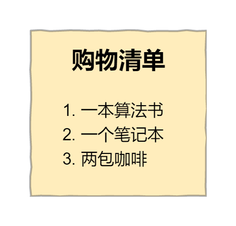

在这张清单中：

- 购物清单中的条目代表的类型可能不同，但是按照一定顺序进行了排列；
- 购物清单的长度是可变的，你可以向购物清单中增加、删除条目。

在编程语言中，列表最常见的表现形式有数组和链表，而我们熟悉的栈和队列则是两种特殊类型的列表。除此之外，向列表中添加、删除元素的具体实现方式会根据编程语言的不同而有所区分。

 

#### 数组

------

数组是列表的实现方式之一，也是面试中经常涉及到的数据结构。

正如前面提到的，数组是列表的实现方式，它具有列表的特征，同时也具有自己的一些特征。然而，在具体的编程语言中，数组这个数据结构的实现方式具有一定差别。比如 C++ 和 Java 中，数组中的元素类型必须保持一致，而 Python 中则可以不同。Python 中的数组叫做 list，具有更多的高级功能。

那么如何从宏观上区分列表和数组呢？这里有一个重要的概念：**索引**。

首先，数组会用一些名为 `索引` 的数字来标识每项数据在数组中的位置，且在大多数编程语言中，索引是从 `0` 算起的。我们可以根据数组中的索引，快速访问数组中的元素。


而列表中没有索引，这是数组与列表最大的不同点。

其次，数组中的元素在内存中是连续存储的，且每个元素占用相同大小的内存。要理解这一点，我们需要了解数组在内存中的存储方式，我们将在下一节中详细介绍。

 


 

相反，列表中的元素在内存中可能彼此相邻，也可能不相邻。比如列表的另一种实现方式——链表，它的元素在内存中则不一定是连续的。


### 数组的操作

------

本节我们重点来讲解一下数组的 4 种操作。

 

#### 读取元素

------

读取数组中的元素，即通过数组的索引访问数组中的元素。

这里的索引其实就是内存地址，值得一提的是，计算机可以跳跃到任意的内存地址上，这就意味着只要计算出数组中元素的内存地址，则可以一步访问到数组中的元素。

可以形象地将计算机中的内存看作一系列排列好的格子，这些格子中，每一个格子对应一个内存地址，数据会存储在不同的格子中。

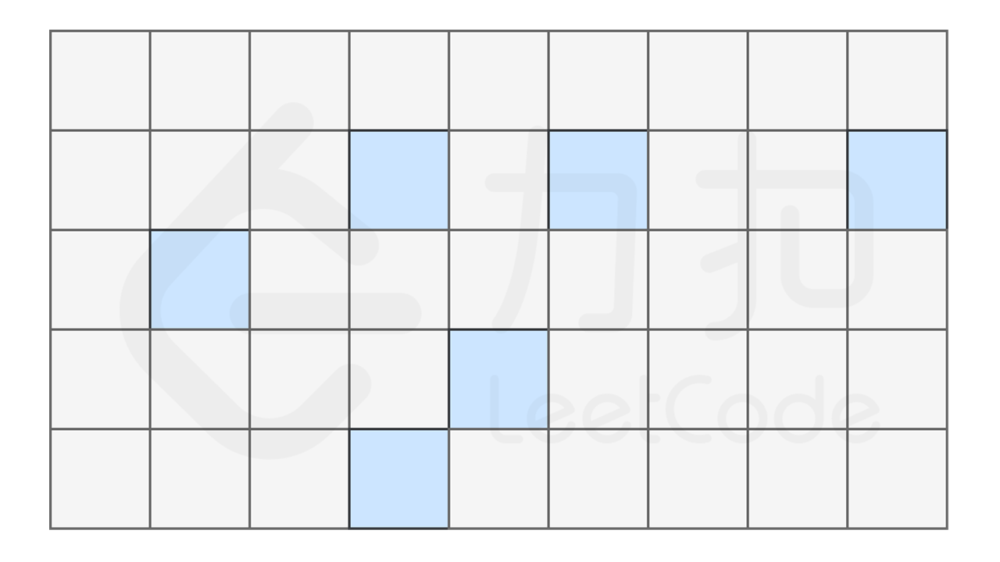

而对于数组，计算机会在内存中申请一段 **连续** 的空间，并且会记下索引为 `0` 处的内存地址。例如对于一个数组 `['oranges', 'apples', 'bananas', 'pears', 'tomatoes']`，为了方便起见，我们假设每个元素只占用一个字节，它的索引与内存地址的关系如下图所示。

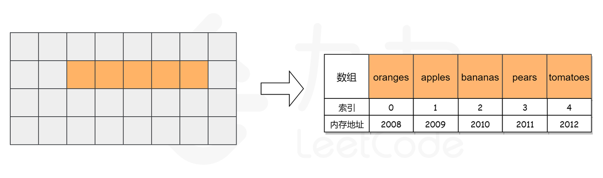

当我们访问数组中索引为 `3` 处的元素时，计算机会进行如下计算：

- 找到该数组的索引 `0` 的内存地址： `2008`；
- `pears` 的索引为 `3`，计算该元素的内存地址为 `2008 + 3 = 2011`；

接下来，计算机就可以在直接通过该地址访问到数组中索引为 `3` 的元素了，计算过程很快，因此可以将整个访问过程只看作一个动作，因此时间复杂度为 O(1)*O*(1)。

 

查找元素

------

前面我们谈到计算机只会保存数组中索引为 `0` 处元素的内存地址，因此当计算机想要知道数组中是否包含某个元素时，只能从索引 `0` 处开始，逐步向后查询。

还是上面的例子，如果我们要查找数组中是否包含元素 `pears`，计算机会从索引 `0` 开始，逐个比较对应的元素，直到找到该元素后停止搜索，或到达数组的末尾后停止。


我们发现，该数组的长度为 `5`，最坏情况下（比如我们查找元素 `tomatoes` 或查找数组中不包含的元素），我们需要查询数组中的每个元素，因此时间复杂度为 O(N)*O*(*N*)，N*N* 为数组的长度。

 

#### 插入元素

------

假如我们想在原有的数组中再插入一个元素 `flowers` 呢？

如果要将该元素插入到数组的末尾，只需要一步。即计算机通过数组的长度和位置计算出即将插入元素的内存地址，然后将该元素插入到指定位置即可。

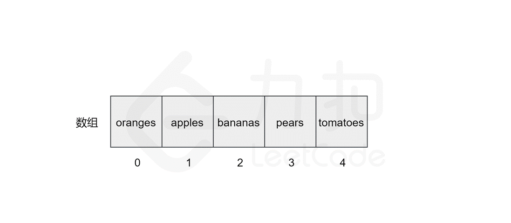

然而，如果要将该元素插入到数组中的其他位置，则会有所区别，这时我们首先需要为该元素所要插入的位置`腾出` 空间，然后进行插入操作。比如，我们想要在索引 `2` 处插入 `flowers`。

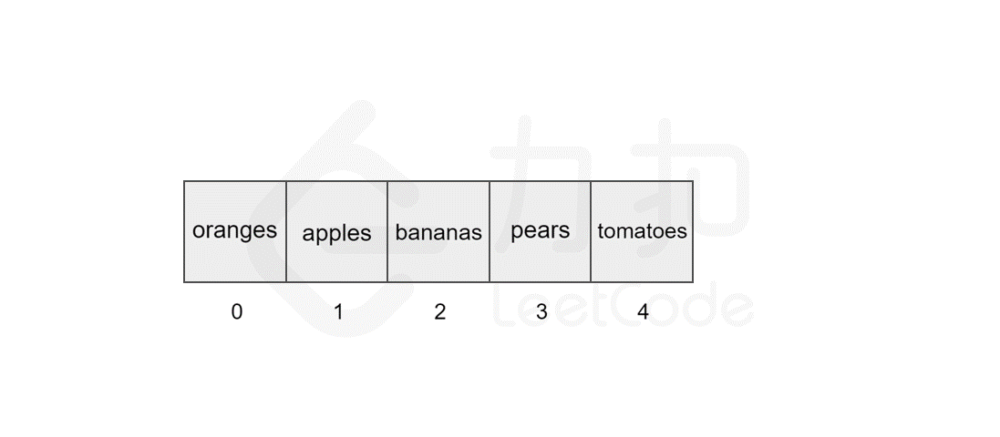

我们发现，如果需要频繁地对数组元素进行插入操作，会造成时间的浪费。事实上，另一种数据结构，即链表可以有效解决这个问题。

 

#### 删除元素

------

删除元素与插入元素的操作类似，当我们删除掉数组中的某个元素后，数组中会留下 `空缺` 的位置，而数组中的元素在内存中是连续的，这就使得后面的元素需对该位置进行 `填补` 操作。

以删除索引 `1` 中的元素 `apples` 为例，具体过程如图所示。

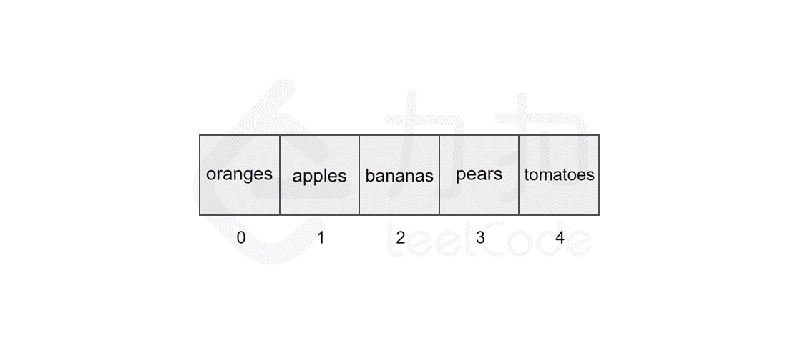

同样地，数组的长度为 `5`，最坏情况下，我们删除第一个元素，后面的 `4` 个元素需要向前移动，加上删除操作，共需执行 `5` 步，因此时间复杂度为 O(N)*O*(*N*)，N*N* 为数组的长度。


### (一维)数组简介

`数组`和`动态数组`，是应当熟悉的基本数据结构

> **数组**

`数组`是一种基本的数据结构，用于按顺序`存储元素的集合`。但是元素可以随机存取，因为数组中的每个元素都可以通过数组`索引`来识别。

数组可以有一个或多个维度。这里我们从`一维数组`开始，它也被称为线性数组。这里有一个例子：


在上面的例子中，数组 A 中有 6 个元素。也就是说，A 的长度是 6 。我们可以使用 A[0] 来表示数组中的第一个元素。因此，A[0] = 6 。类似地，A[1] = 3，A[2] = 8，依此类推。

> **动态数组**

数组具有`固定的容量`，我们需要在初始化时指定数组的大小。有时它会非常不方便并可能造成浪费。

因此，大多数编程语言都提供内置的`动态数组`，它仍然是一个随机存取的列表数据结构，但`大小是可变的`。例如，在 C++ 中的 `vector`，以及在 Java 中的 `ArrayList`。

### 

#### ·寻找数组的中心索引pivotIndex

给定一个整数类型的数组 `nums`，请编写一个能够返回数组**“中心索引”**的方法。

我们是这样定义数组**中心索引**的：数组中心索引的左侧所有元素相加的和等于右侧所有元素相加的和。

如果数组不存在中心索引，那么我们应该返回 -1。如果数组有多个中心索引，那么我们应该返回最靠近左边的那一个。

**示例 1:**

```
输入: 
nums = [1, 7, 3, 6, 5, 6]
输出: 3
解释: 
索引3 (nums[3] = 6) 的左侧数之和(1 + 7 + 3 = 11)，与右侧数之和(5 + 6 = 11)相等。
同时, 3 也是第一个符合要求的中心索引。
```

**示例 2:**

```
输入: 
nums = [1, 2, 3]
输出: -1
解释: 
数组中不存在满足此条件的中心索引。
```

**说明:**

- `nums` 的长度范围为 `[0, 10000]`。
- 任何一个 `nums[i]` 将会是一个范围在 `[-1000, 1000]`的整数。


#### ·至少是其他数字两倍的最大数dominantIndex


在一个给定的数组`nums`中，总是存在一个最大元素 。

查找数组中的最大元素是否至少是数组中每个其他数字的两倍。

如果是，则返回最大元素的索引，否则返回-1。

**示例 1:**

```
输入: nums = [3, 6, 1, 0]
输出: 1
解释: 6是最大的整数, 对于数组中的其他整数,
6大于数组中其他元素的两倍。6的索引是1, 所以我们返回1.
```

 

**示例 2:**

```
输入: nums = [1, 2, 3, 4]
输出: -1
解释: 4没有超过3的两倍大, 所以我们返回 -1.
```

 

**提示:**

1. `nums` 的长度范围在`[1, 50]`.
2. 每个 `nums[i]` 的整数范围在 `[0, 100]`.


#### ·加一plusOne


给定一个由**整数**组成的**非空**数组所表示的非负整数，在该数的基础上加一。

最高位数字存放在数组的首位， 数组中每个元素只存储**单个**数字。

你可以假设除了整数 0 之外，这个整数不会以零开头。

**示例 1:**

```
输入: [1,2,3]
输出: [1,2,4]
解释: 输入数组表示数字 123。
```

**示例 2:**

```
输入: [4,3,2,1]
输出: [4,3,2,2]
解释: 输入数组表示数字 4321。
```


#### ·搜索插入位置searchInsert


给定一个排序数组和一个目标值，在数组中找到目标值，并返回其索引。如果目标值不存在于数组中，返回它将会被按顺序插入的位置。

你可以假设数组中无重复元素。

**示例 1:**

```
输入: [1,3,5,6], 5
输出: 2
```

**示例 2:**

```
输入: [1,3,5,6], 2
输出: 1
```

**示例 3:**

```
输入: [1,3,5,6], 7
输出: 4
```

**示例 4:**

```
输入: [1,3,5,6], 0
输出: 0
```


####  ·合并区间merge


给出一个区间的集合，请合并所有重叠的区间。

**示例 1:**

```
输入: [[1,3],[2,6],[8,10],[15,18]]
输出: [[1,6],[8,10],[15,18]]
解释: 区间 [1,3] 和 [2,6] 重叠, 将它们合并为 [1,6].
```

**示例 2:**

```
输入: [[1,4],[4,5]]
输出: [[1,5]]
解释: 区间 [1,4] 和 [4,5] 可被视为重叠区间。
```


### 二维数组

简介

类似于一维数组，`二维数组`也是由元素的序列组成。但是这些元素可以排列在矩形网格中而不是直线上。

在一些语言中，多维数组实际上是在`内部`作为一维数组实现的，而在其他一些语言中，`实际上`根本没有`多维数组`。

实际上二维数组是一种结构较为特殊的数组，只是将数组中的每个元素变成了一维数组。

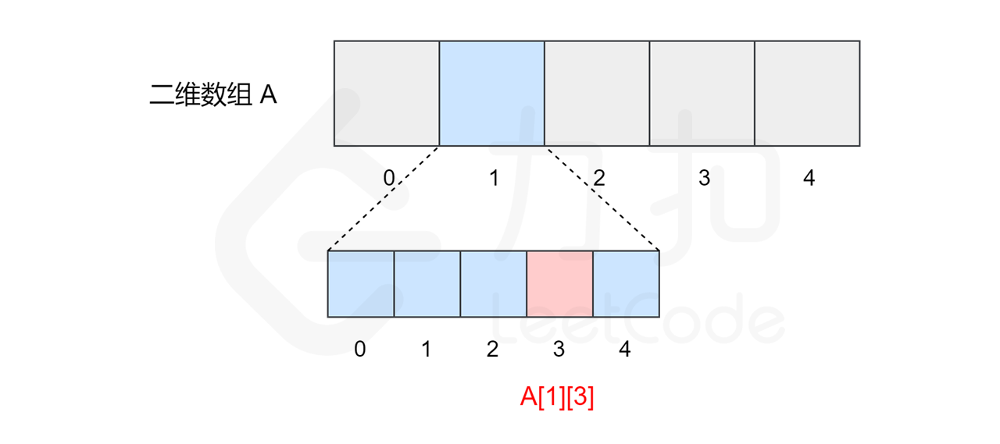

所以二维数组的本质上仍然是一个一维数组，内部的一维数组仍然从索引 `0` 开始，我们可以将它看作一个矩阵，并处理矩阵的相关问题。

类似一维数组，对于一个二维数组 `A = [[1, 2, 3, 4],[2, 4, 5, 6],[1, 4, 6, 8]]`，计算机同样会在内存中申请一段 **连续** 的空间，并记录第一行数组的索引位置，即 `A[0][0]` 的内存地址，它的索引与内存地址的关系如下图所示。

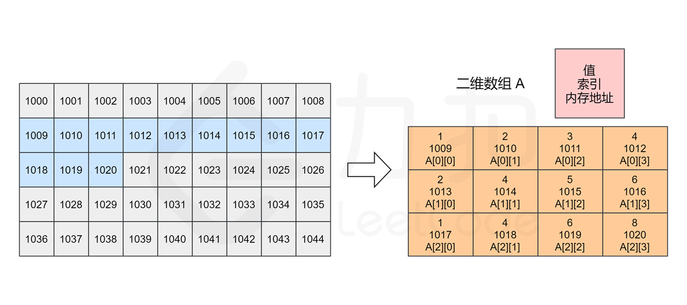

注意，实际数组中的元素由于类型的不同会占用不同的字节数，因此每个方格地址之间的差值可能不为 `1`。

实际题目中，往往使用二维数据处理矩阵类相关问题，包括矩阵旋转、对角线遍历，以及对子矩阵的操作等。

**1. C++ 将二维数组存储为一维数组。**

下图显示了*大小为 M \* N 的数组 A* 的实际结构：


因此，如果我们将 A 定义为也包含 *M \* N* 个元素的一维数组，那么实际上 A[i][j] 就等于 A[i * N + j]。

 

**2. 在Java中，二维数组实际上是包含着 M 个元素的一维数组，每个元素都是包含有 N 个整数的数组。**

下图显示了 Java 中二维数组 A 的实际结构：


 

#### 动态二维数组

------

与一维动态数组类似，我们也可以定义动态二维数组。 实际上，它可以只是一个嵌套的动态数组。 


#### ·旋转矩阵rotate


给你一幅由 `N × N` 矩阵表示的图像，其中每个像素的大小为 4 字节。请你设计一种算法，将图像旋转 90 度。

不占用额外内存空间能否做到？

 **示例 1:**

```
给定 matrix = 
[
  [1,2,3],
  [4,5,6],
  [7,8,9]
],

原地旋转输入矩阵，使其变为:
[
  [7,4,1],
  [8,5,2],
  [9,6,3]
]
```

**示例 2:**

```
给定 matrix =
[
  [ 5, 1, 9,11],
  [ 2, 4, 8,10],
  [13, 3, 6, 7],
  [15,14,12,16]
], 

原地旋转输入矩阵，使其变为:
[
  [15,13, 2, 5],
  [14, 3, 4, 1],
  [12, 6, 8, 9],
  [16, 7,10,11]
]
```


#### ·零矩阵setZeroes


编写一种算法，若M × N矩阵中某个元素为0，则将其所在的行与列清零。

 **示例 1：**

```
输入：
[
  [1,1,1],
  [1,0,1],
  [1,1,1]
]
输出：
[
  [1,0,1],
  [0,0,0],
  [1,0,1]
]
```

**示例 2：**

```
输入：
[
  [0,1,2,0],
  [3,4,5,2],
  [1,3,1,5]
]
输出：
[
  [0,0,0,0],
  [0,4,5,0],
  [0,3,1,0]
]
```


#### ·对角线遍历findDiagonalOrder


给定一个含有 M x N 个元素的矩阵（M 行，N 列），请以对角线遍历的顺序返回这个矩阵中的所有元素，对角线遍历如下图所示。

 **示例:**

```
输入:
[
 [ 1, 2, 3 ],
 [ 4, 5, 6 ],
 [ 7, 8, 9 ]
]

输出:  [1,2,4,7,5,3,6,8,9]
1、2、3、4
5、6、7、8
9、8、6、6

1 2 5 9 6 3 4 7 8 16 8 6
m3 n4 (2,3)
(0,0)
(0,1)(1,0)
(2,0)(1,1)(0,2)
(0,3)(1,2)(2,1)
(2,2)(1,3)
(2,3)
1 2 5 9 6 3 4 7 8 16 8 6
```

 

**说明:**

1. 给定矩阵中的元素总数不会超过 100000 。


## 字符串

字符串是一个由字符构成的数组。需要

- 熟悉字符串中的 `基本操作`，尤其是在数组中没有的独特操作；
- 理解不同 `比较` 函数之间的区别；
- 理解字符串 `是否可变` 以及导致连接过程中出现的问题；
- 能够解决与字符串相关的基本问题，如排序、子串、字符串匹配等。

### 字符串简介

[维基百科](https://zh.wikipedia.org/wiki/%E5%AD%97%E7%AC%A6%E4%B8%B2)：字符串是由零个或多个字符组成的有限序列。一般记为 s = a1a2...an。它是编程语言中表示文本的数据类型


### 为何单独讨论字符串类型

------

我们知道，字符串与数组有很多相似之处，比如使用 `名称[下标]` 来得到一个字符。那么我们为什么要单独讨论字符串呢？原因主要有：

*1.字符串的基本操作对象通常是**字符串整体或者其子串***

例如有这样一个字符串序列：`I like leetcode` 现在你想把这句话反向输出，可能会变成这样：

```
edocteel ekil I
```

这是我们想要的结果吗？你可能会回答不是，因为它没有任何意义。我们通常希望单词仍然维持原来的顺序，这样反向输出之后就是：

```
Leetcode like I
```

这样的结果对于我们来讲是不是更满意呢？维持单词本身的顺序使得我们方便进行更多操作，这里的每个个单词就叫做字符串的「子串」，通常，我们的操作对象更多情况下是这些子串。

*2. 字符串操作比其他数据类型更复杂（例如比较、连接操作）*

对于不同的编程语言，字符串的某些操作会有所不同。下面我们将从字符串的「比较」和「连接」操作两个方面份别进行讲解。

 

### 比较函数

------

字符串有它自己的比较函数（我们将在下面的代码中向你展示比较函数的用法）。

然而，存在这样一个问题：

> 我们可以用 “==” 来比较两个字符串吗？

这取决于下面这个问题的答案：

> 我们使用的语言是否支持运算符重载？

- 如果答案是 `yes` （例如 C++、Python）。我们可以使用 `==` 来比较两个字符串；
- 如果答案是 `no` （例如 Java），我们可能无法使用 `==` 来比较两个字符串。当我们使用 `==` 时，它实际上会比较这两个对象是否是同一个对象。


### 连接操作

------

对于不同的编程语言中，字符串可能是可变的，也可能是不可变的。不可变意味着一旦字符串被初始化，你就无法改变它的内容。

- 在某些语言（如 C ++）中，字符串是可变的。 也就是说，你可以像在数组中那样修改字符串。
- 在其他一些语言（如 Java、Python）中，字符串是不可变的。

你可以通过测试修改操作来确定你喜欢的语言中的字符串是否可变。

在 **字符串不可变** 的语言中，进行字符串的连接操作则会带来一些问题。

显然，不可变字符串无法被修改。哪怕你只是想修改其中的一个字符，也必须创建一个新的字符串。

我们发现在 C++ 中，进行字符串连接并没有明显的性能影响。

然而，对于 Java来说，由于字符串是不可变的，因此在连接时首先为新字符串分配足够的空间，复制旧字符串中的内容并附加到新字符串。

因此，总时间复杂度将是：

```
5+5×2+5×3+…+5×n=5×(1+2+3+…+n)=5×n×(n+1)/2 
即 O(N^2)。
```

针对 Java 中出现的此问题，我们提供了以下解决方案：

- 如果你确实希望你的字符串是可变的，则可以使用 `toCharArray` 将其转换为字符数组。
- 如果你经常必须连接字符串，最好使用一些其他的数据结构，如 `StringBuilder` 。


#### ·最长公共前缀longestCommonPrefix


编写一个函数来查找字符串数组中的最长公共前缀。

如果不存在公共前缀，返回空字符串 `""`。

**示例 1:**

```
输入: ["flower","flow","flight"]
输出: "fl"
```

**示例 2:**

```
输入: ["dog","racecar","car"]
输出: ""
解释: 输入不存在公共前缀。
```

**说明:**

所有输入只包含小写字母 `a-z` 。


#### ·最长回文子串longestPalindrome


给定一个字符串 `s`，找到 `s` 中最长的回文子串。你可以假设 `s` 的最大长度为 1000。

**示例 1：**

```
输入: "babad"
输出: "bab"
注意: "aba" 也是一个有效答案。
```

**示例 2：**

```
输入: "cbbd"
输出: "bb"
```


#### ·翻转字符串里的单词reverseWords

给定一个字符串，逐个翻转字符串中的每个单词。

 **示例 1：**

```
输入: "the sky is blue"
输出: "blue is sky the"
```

**示例 2：**

```
输入: "  hello world!  "
输出: "world! hello"
解释: 输入字符串可以在前面或者后面包含多余的空格，但是反转后的字符不能包括。
```

**示例 3：**

```
输入: "a good   example"
输出: "example good a"
解释: 如果两个单词间有多余的空格，将反转后单词间的空格减少到只含一个。
```

 

**说明：**

- 无空格字符构成一个单词。
- 输入字符串可以在前面或者后面包含多余的空格，但是反转后的字符不能包括。
- 如果两个单词间有多余的空格，将反转后单词间的空格减少到只含一个。

 

**进阶：**

请选用 C 语言的用户尝试使用 *O*(1) 额外空间复杂度的原地解法。


### 字符串匹配算法：KMP

------

Knuth–Morris–Pratt（KMP）算法是一种改进的字符串匹配算法，它的核心是利用匹配失败后的信息，尽量减少模式串与主串的匹配次数以达到快速匹配的目的。它的时间复杂度是*`O*(*m*+*n*)`。

这段话你可能并不理解。没关系，我们来看一个例子。 

#### 情景 1

------

假如你是一名生物学家，现在，你的面前有两段 DNA 序列 `S` 和 `T`，你需要判断 `T` 是否可以匹配成为 `S` 的子串。

你可能会凭肉眼立即得出结论：**是匹配的**。可是计算机没有眼睛，只能对每个字符进行逐一比较。

对于计算机来讲，首先它会从左边第一个位置开始进行逐一比较：


这样，当匹配到 `T` 的最后一个字符时，发现不匹配，于是从 `S` 的第二个字符开始重新进行比较：


仍然不匹配，再次将 `T` 与 `S` 的第三个字符开始匹配......不断重复以上步骤，直到从 S 的第四个字符开始时，最终得出结论：`S` 与 `T` 是匹配的。


你发现这个方法的弊端了吗？**我们在进行每一轮匹配时，总是会重复对 A 进行比较**。也就是说，对于 `S` 中的每个字符，我们都需要从 `T` 第一个位置重新开始比较，并且 `S` 前面的 `A` 越多，浪费的时间也就越多。假设S的长度为m，T的长度为n，理论上讲，最坏情况下迭代 `m - n + 1`轮，每轮最多进行 *n* 次比对，一共比较了(*m*−*n*+1)×*n* 次，当 `m>>n` 时，渐进时间复杂度为 O(mn)。

而 KMP 算法的好处在于，它可以将时间复杂度降低到 O(m + n)*O*(*m*+*n*)，字符序列越长，该算法的优势越明显。它是怎么实现的呢？

 

#### 情景 2

------

再来举一个例子，现在有如下字符串 `S` 和 `P`，判断 `P` 是否为 `S` 的子串。


我们仍然按照原来的方式进行比较，比较到 `P` 的末尾时，我们发现了不匹配的字符。


注意，按照原来的思路，我们下一步应将字符串 `P` 的开头，与字符串 `S` 的第二位 `C` 重新进行比较。而 KMP 算法告诉我们，我们只需将**字符串 P 需要比较的位置重置到图中 j 的位置，S 保持 i 的位置不变**，接下来即可从 `i`，`j` 位置继续进行比较。

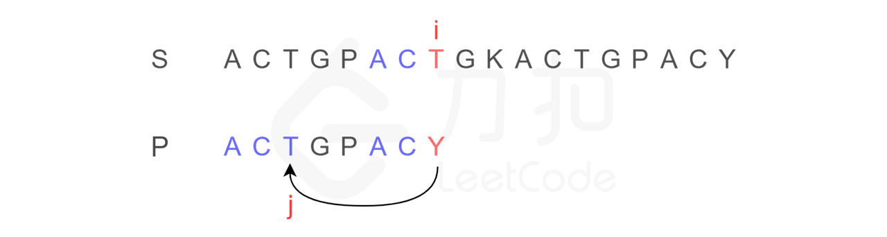

为什么？我们发现字符串 `P` 有子串 `ACT` 和 `ACY`，当 `T` 和 `Y` 不匹配时，我们就确定了 `S` 中的蓝色 `AC` 并不匹配 `P` 右侧的 `AC`，但是可能匹配左侧的 `AC`，所以我们从位置 `i` 和 `j` 继续比较。

换句话说，`Y` 对应下标 `2`，表示下一步要重新开始的地方。

既然如此，如果每次不匹配的时候，我们都能立刻知道 `P` 中不匹配的元素，下一步应该从哪个下标重新开始，这样不就能大大简化匹配过程了吗？这就是 KMP 的核心思想。

KMP 算法中，使用一个数组 `next` 来保存 `P` 中元素不匹配时，下一步应该重新开始的下标。由于计算机不能像我们人类一样，通过视觉来得出结论，因此这里有一种适合计算机的构造 `next` 数组的方法。

 

#### 小插曲：构造 next 数组

------

构造方法为：**P[i] 对应的下标，为 P[0...i + 1] 的最长公共前缀后缀的长度，令 P[0] = -1。** 具体解释如下：

例如对于字符串 `abcba`：

- 前缀：它的前缀包括：`a, ab, abc, abcb`，不包括本身；
- 后缀：它的后缀包括：`bcba, cba, ba, a`，不包括本身；
- 最长公共前缀后缀：`abcba` 的前缀和后缀中只有 `a` 是公共部分，字符串 `a` 的长度为 `1`。

所以，我们将 `P[0...i + 1]` 的最长公共前后缀的长度作为 `P[i]` 的下标，就得到了 `next` 数组。

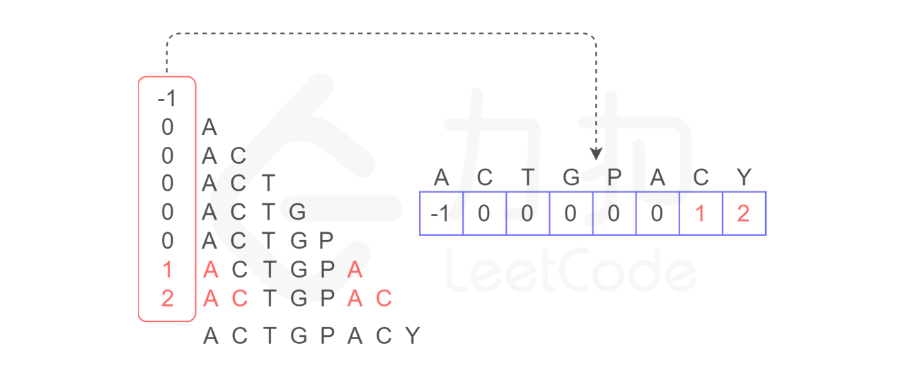

###  

#### 回到情景 2

------

我们将思绪切换回来，上次我们还停留在位置 `i` 和 `j`，现在继续进行比较。从如下图所示，由于我们已经构造了 `next` 数组，当继续移动到图中的 `r` 和 `c` 位置时，发现不匹配，根据 `next` 数组，我们可以立即将位置 `c` 回到下标 `0` 的位置：


之后的情形就很简单了：

- `K` 与 `A` 不匹配，查看 `next` 数组，`A` 对应 `next` 中的元素为 `-1`，表示不动，`r` 加 `1`；
- 位置 `r` 字符与位置 `c` 字符匹配，继续比较下一位；
- 后面元素均匹配，最终找到匹配元素。

以上就是 KMP 算法的思想，现在回过头来看文章开头的第一句话，你是否有更加深刻的理解了呢？

最后，我们给出相关代码。

#### KMP 主算法参考代码：

```
int* buildNext(char* P) { // 构造模式串 P 的 next 表
    size_s m = strlen(P), j = 0; // “主”串指针
    int* N = new int[m]; // next 表
    int  t = N[0] = -1; // 模式串指针
    while (j < m - 1)
        if ( 0 > t || P[j] == P[t]){ // 匹配
            j++; t++;
            N[j] = t; // 此句可改进为 N[j] = (P[j] != P[t] ? t : N[t]);
        }else // 失配
        t = N[t];
    return N;

}

int match (char* P, char* S){ // KMP 算法
    int* next = buildNext(P); // 构造 next 表
    int m = (int) strlen (S), i = 0; // 文本串指针
    int n = (int) strlen(P), j = 0; //模式串指针
    while (j < n && i < m) // 自左向右逐个比对字符
        if (0 > j || S[i] == P[j]) // 若匹配，或 P 已移除最左侧
            {i++; j++} // 则转到下一字符
        else
            j = next[j]; // 模式串右移（注意：文本串不用回退）
    delete [] next; // 释放 next 表
    return i - j;
}
```


## 双指针

 `双指针技巧`，它可以帮助我们解决许多与数组/字符串相关的问题。

### 相向迭代

我们通过迭代数组来解决一些问题。通常，我们只需要一个指针进行迭代，即从数组中的第一个元素开始，最后一个元素结束。然而，有时我们会使用两个指针从两端向中间进行迭代。

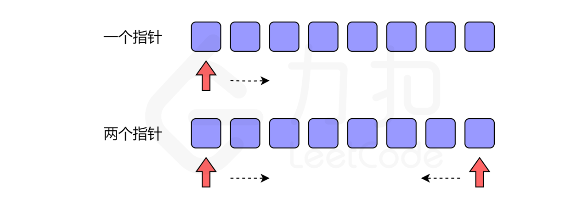

经典问题：反转数组


#### 数组拆分 I arrayPairSum

给定长度为 **2n** 的数组, 你的任务是将这些数分成 **n** 对, 例如 (a1, b1), (a2, b2), ..., (an, bn) ，使得从1 到 n 的 min(ai, bi) 总和最大。

**示例 1:**

```
输入: [1,4,3,2]

输出: 4
解释: n 等于 2, 最大总和为 4 = min(1, 2) + min(3, 4).
```

**提示:**

1. **n** 是正整数,范围在 [1, 10000].
2. 数组中的元素范围在 [-10000, 10000].

#### 两数之和 II - 输入有序数组 twoSum2

给定一个已按照**升序排列** 的有序数组，找到两个数使得它们相加之和等于目标数。

函数应该返回这两个下标值 index1 和 index2，其中 index1 必须小于 index2*。*

**说明:**

- 返回的下标值（index1 和 index2）不是从零开始的。
- 你可以假设每个输入只对应唯一的答案，而且你不可以重复使用相同的元素。

**示例:**

```
输入: numbers = [2, 7, 11, 15], target = 9
输出: [1,2]
解释: 2 与 7 之和等于目标数 9 。因此 index1 = 1, index2 = 2 。
```


### 同向迭代

有时，我们可以使用两个不同步的指针来解决问题，即快慢指针。与情景一不同的是，两个指针的运动方向是相同的，而非相反。

经典问题：数组删除

> 给你一个数组 `nums` 和一个值 `val`，你需要 **原地** 移除所有数值等于 `val` 的元素，并返回移除后数组的新长度。

如果我们没有空间复杂度上的限制，那就更容易了。我们可以初始化一个新的数组来存储答案。如果元素不等于给定的目标值，则迭代原始数组并将元素添加到新的数组中。

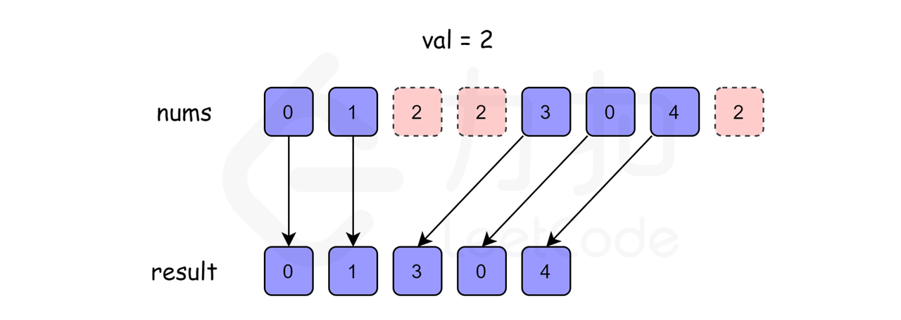

实际上，它相当于使用了两个指针，一个用于原始数组的迭代，另一个总是指向新数组的最后一个位置。

考虑空间限制

如果我们不使用额外的数组，只是在原数组上进行操作呢？

此时，我们就可以采用快慢指针的思想：初始化一个快指针 `fast` 和一个慢指针 `slow`，`fast` 每次移动一步，而 `slow` 只当 `fast` 指向的值不等于 `val` 时才移动一步。


#### 移除元素 removeElement

给你一个数组 *nums* 和一个值 *val*，你需要 **原地** 移除所有数值等于 *val* 的元素，并返回移除后数组的新长度。

不要使用额外的数组空间，你必须仅使用 O(1) 额外空间并 **原地 修改输入数组**。

元素的顺序可以改变。你不需要考虑数组中超出新长度后面的元素。

 **示例 1:**

```
给定 nums = [3,2,2,3], val = 3,

函数应该返回新的长度 2, 并且 nums 中的前两个元素均为 2。

你不需要考虑数组中超出新长度后面的元素。
```

**示例 2:**

```
给定 nums = [0,1,2,2,3,0,4,2], val = 2,

函数应该返回新的长度 5, 并且 nums 中的前五个元素为 0, 1, 3, 0, 4。

注意这五个元素可为任意顺序。

你不需要考虑数组中超出新长度后面的元素。
```

 **说明:**

为什么返回数值是整数，但输出的答案是数组呢?

请注意，输入数组是以**「引用」**方式传递的，这意味着在函数里修改输入数组对于调用者是可见的。

你可以想象内部操作如下:

```
// nums 是以“引用”方式传递的。也就是说，不对实参作任何拷贝
int len = removeElement(nums, val);

// 在函数里修改输入数组对于调用者是可见的。
// 根据你的函数返回的长度, 它会打印出数组中 该长度范围内 的所有元素。
for (int i = 0; i < len; i++) {
    print(nums[i]);
}
```


#### 最大连续1的个数 findMaxConsecutiveOnes

给定一个二进制数组， 计算其中最大连续1的个数。

**示例 1:**

```
输入: [1,1,0,1,1,1]
输出: 3
解释: 开头的两位和最后的三位都是连续1，所以最大连续1的个数是 3.
```

**注意：**

- 输入的数组只包含 `0` 和`1`。
- 输入数组的长度是正整数，且不超过 10,000。

####   

#### 长度最小的子数组 minSubArrayLen

给定一个含有 **n** 个正整数的数组和一个正整数 **s ，**找出该数组中满足其和 **≥ s** 的长度最小的 **连续** 子数组，并返回其长度**。**如果不存在符合条件的子数组，返回 0。

 **示例：**

```
输入：s = 7, nums = [2,3,1,2,4,3]
输出：2
解释：子数组 [4,3] 是该条件下的长度最小的子数组。
```

 

**进阶：**

- 如果你已经完成了 *O*(*n*) 时间复杂度的解法, 请尝试 *O*(*n* log *n*) 时间复杂度的解法。


## 数组相关的技术 

------

你可能想要了解更多与数组相关的数据结构或技术，你可以在其他 「探索」卡片中进行深入学习，我们将在下方提供相应的卡片链接。

1. 这里有一些其他类似于数组的数据结构，但具有一些不同的属性：
   - [字符串](https://leetcode-cn.com/explore/learn/card/array-and-string/203/introduction-to-string/)（已包含在本卡片中）
   - [哈希表](https://leetcode-cn.com/explore/learn/card/hash-table/)
   - [链表](https://leetcode-cn.com/explore/learn/card/linked-list/)
   - 队列
   - 栈
2. 正如我们所提到的，我们可以调用内置函数来对数组进行排序。但是，理解一些广泛使用的排序算法的原理及其复杂度是很有用的。
3. [二分查找](https://leetcode-cn.com/explore/learn/card/binary-search/)也是一种重要的技术，用于在排序数组中搜索特定的元素。
4. 我们在这一章中引入了双指针技巧。想要灵活运用该技技巧是不容易的。这一技巧也可以用来解决：
   - [链表中的慢指针和快指针问题](https://leetcode-cn.com/explore/learn/card/linked-list/214/linked-list-two-pointer/)
   - 滑动窗口问题
5. 双指针技巧有时与贪心算法有关，它可以帮助我们设计指针的移动策略。 我们将会提供更多的卡片来介绍上面提到的这些技术，并更新链接。


#### 杨辉三角generate

给定一个非负整数 *numRows，*生成杨辉三角的前 *numRows* 行。


在杨辉三角中，每个数是它左上方和右上方的数的和。

**示例:**

```
输入: 5
输出:
[
     [1],
    [1,1],
   [1,2,1],
  [1,3,3,1],
 [1,4,6,4,1]
]
```


#### 杨辉三角 II getRow

给定一个非负索引 *k*，其中 *k* ≤ 33，返回杨辉三角的第 *k* 行。


在杨辉三角中，每个数是它左上方和右上方的数的和。

**示例:**

```
输入: 3
输出: [1,3,3,1]
```

**进阶：**

你可以优化你的算法到 *O*(*k*) 空间复杂度吗？

#### 反转字符串中的单词 III reverseWords

给定一个字符串，你需要反转字符串中每个单词的字符顺序，同时仍保留空格和单词的初始顺序。

**示例 1:**

```
输入: "Let's take LeetCode contest"
输出: "s'teL ekat edoCteeL tsetnoc" 
```

**注意：**在字符串中，每个单词由单个空格分隔，并且字符串中不会有任何额外的空格。

#### 寻找旋转排序数组中的最小值 findMin

假设按照升序排序的数组在预先未知的某个点上进行了旋转。

( 例如，数组 `[0,1,2,4,5,6,7]` 可能变为 `[4,5,6,7,0,1,2]` )。

请找出其中最小的元素。

你可以假设数组中不存在重复元素。

**示例 1:**

```
输入: [3,4,5,1,2]
输出: 1
```

**示例 2:**

```
输入: [4,5,6,7,0,1,2]
输出: 0
```


# 队列&栈

## 队列 

### 先入先出数据结构

------


在 FIFO 数据结构中，将`首先处理添加到队列中的第一个元素`。

如上图所示，队列是典型的 FIFO 数据结构。插入（insert）操作也称作入队（enqueue），新元素始终被添加在`队列的末尾`。 删除（delete）操作也被称为出队（dequeue)。 你只能移除`第一个元素`。

入队与出队


### 实现

------

为了实现队列，我们可以使用动态数组和指向队列头部的索引。

如上所述，队列应支持两种操作：入队和出队。入队会向队列追加一个新元素，而出队会删除第一个元素。 所以我们需要一个索引来指出起点。

```c++
#include <iostream>

class MyQueue {
    private:
        // store elements
        vector<int> data;       
        // a pointer to indicate the start position
        int p_start;            
    public:
        MyQueue() {p_start = 0;}
        /** Insert an element into the queue. Return true if the operation is successful. */
        bool enQueue(int x) {
            data.push_back(x);
            return true;
        }
        /** Delete an element from the queue. Return true if the operation is successful. */
        bool deQueue() {
            if (isEmpty()) {
                return false;
            }
            p_start++;
            return true;
        };
        /** Get the front item from the queue. */
        int Front() {
            return data[p_start];
        };
        /** Checks whether the queue is empty or not. */
        bool isEmpty()  {
            return p_start >= data.size();
        }
};
```


```java
// "static void main" must be defined in a public class.

class MyQueue {
    // store elements
    private List<Integer> data;         
    // a pointer to indicate the start position
    private int p_start;            
    public MyQueue() {
        data = new ArrayList<Integer>();
        p_start = 0;
    }
    /** Insert an element into the queue. Return true if the operation is successful. */
    public boolean enQueue(int x) {
        data.add(x);
        return true;
    };    
    /** Delete an element from the queue. Return true if the operation is successful. */
    public boolean deQueue() {
        if (isEmpty() == true) {
            return false;
        }
        p_start++;
        return true;
    }
    /** Get the front item from the queue. */
    public int Front() {
        return data.get(p_start);
    }
    /** Checks whether the queue is empty or not. */
    public boolean isEmpty() {
        return p_start >= data.size();
    }     
};

public class Main {
    public static void main(String[] args) {
        MyQueue q = new MyQueue();
        q.enQueue(5);
        q.enQueue(3);
        if (q.isEmpty() == false) {
            System.out.println(q.Front());
        }
        q.deQueue();
        if (q.isEmpty() == false) {
            System.out.println(q.Front());
        }
        q.deQueue();
        if (q.isEmpty() == false) {
            System.out.println(q.Front());
        }
    }
}
```

上面的实现很简单，但在某些情况下效率很低。 随着起始指针的移动，浪费了越来越多的空间。 当我们有空间限制时，这将是难以接受的。


让我们考虑一种情况，即我们只能分配一个最大长度为 5 的数组。当我们只添加少于 5 个元素时，我们的解决方案很有效。 例如，如果我们只调用入队函数四次后还想要将元素 10 入队，那么我们可以成功。

但是我们不能接受更多的入队请求，这是合理的，因为现在队列已经满了。但是如果我们将一个元素出队呢？


实际上，在这种情况下，我们应该能够再接受一个元素。


### 循环队列

------

此前，我们提供了一种简单但低效的队列实现。

更有效的方法是使用循环队列。 具体来说，我们可以使用`固定大小的数组`和`两个指针`来指示起始位置和结束位置。 目的是`重用`我们之前提到的`被浪费的存储`。

让我们通过一个示例来查看循环队列的工作原理。 你应该注意我们`入队`或`出队`元素时使用的策略。

#### 设计循环队列

------

设计你的循环队列实现。 循环队列是一种线性数据结构，其操作表现基于 FIFO（先进先出）原则并且队尾被连接在队首之后以形成一个循环。它也被称为“环形缓冲器”。

循环队列的一个好处是我们可以利用这个队列之前用过的空间。在一个普通队列里，一旦一个队列满了，我们就不能插入下一个元素，即使在队列前面仍有空间。但是使用循环队列，我们能使用这些空间去存储新的值。

你的实现应该支持如下操作：

- `MyCircularQueue(k)`: 构造器，设置队列长度为 k 。
- `Front`: 从队首获取元素。如果队列为空，返回 -1 。
- `Rear`: 获取队尾元素。如果队列为空，返回 -1 。
- `enQueue(value)`: 向循环队列插入一个元素。如果成功插入则返回真。
- `deQueue()`: 从循环队列中删除一个元素。如果成功删除则返回真。
- `isEmpty()`: 检查循环队列是否为空。
- `isFull()`: 检查循环队列是否已满。

```c
MyCircularQueue circularQueue = new MyCircularQueue(3); // 设置长度为 3

circularQueue.enQueue(1);  // 返回 true

circularQueue.enQueue(2);  // 返回 true

circularQueue.enQueue(3);  // 返回 true

circularQueue.enQueue(4);  // 返回 false，队列已满

circularQueue.Rear();  // 返回 3

circularQueue.isFull();  // 返回 true

circularQueue.deQueue();  // 返回 true

circularQueue.enQueue(4);  // 返回 true

circularQueue.Rear();  // 返回 4
```


#### 实现循环队列

在循环队列中，我们使用一个`数组`和两个指针（`head` 和 `tail`）。 `head` 表示队列的起始位置，`tail` 表示队列的结束位置。

### 示例

```java
class MyCircularQueue {
    
    private int[] data;
    private int head;
    private int tail;
    private int size;

    /** Initialize your data structure here. Set the size of the queue to be k. */
    public MyCircularQueue(int k) {
        data = new int[k];
        head = -1;
        tail = -1;
        size = k;
    }
    
    /** Insert an element into the circular queue. Return true if the operation is successful. */
    public boolean enQueue(int value) {
        if (isFull() == true) {
            return false;
        }
        if (isEmpty() == true) {
            head = 0;
        }
        tail = (tail + 1) % size;
        data[tail] = value;
        return true;
    }
    
    /** Delete an element from the circular queue. Return true if the operation is successful. */
    public boolean deQueue() {
        if (isEmpty() == true) {
            return false;
        }
        if (head == tail) {
            head = -1;
            tail = -1;
            return true;
        }
        head = (head + 1) % size;
        return true;
    }
    
    /** Get the front item from the queue. */
    public int Front() {
        if (isEmpty() == true) {
            return -1;
        }
        return data[head];
    }
    
    /** Get the last item from the queue. */
    public int Rear() {
        if (isEmpty() == true) {
            return -1;
        }
        return data[tail];
    }
    
    /** Checks whether the circular queue is empty or not. */
    public boolean isEmpty() {
        return head == -1;
    }
    
    /** Checks whether the circular queue is full or not. */
    public boolean isFull() {
        return ((tail + 1) % size) == head;
    }
}

/**
 * Your MyCircularQueue object will be instantiated and called as such:
 * MyCircularQueue obj = new MyCircularQueue(k);
 * boolean param_1 = obj.enQueue(value);
 * boolean param_2 = obj.deQueue();
 * int param_3 = obj.Front();
 * int param_4 = obj.Rear();
 * boolean param_5 = obj.isEmpty();
 * boolean param_6 = obj.isFull();
 */
```


循环队列-实现

```
typedef struct{
    int* head;
    int* tail;
    int* queue;
    int size;
    int currentSize;
}MyCircularQueue;

/** Initialize your data structure here. Set the size of the queue to be k. */
MyCircularQueue* myCircularQueueCreate(int k) {
        MyCircularQueue* mcq;

    mcq = (MyCircularQueue*)malloc( sizeof(MyCircularQueue) );

    printf("[%p]\n", mcq );

    mcq->queue = (int*)malloc( sizeof(int) * k + 1 );
    mcq->head = mcq->queue;
    mcq->tail = mcq->queue + k - 1;
    mcq->size = k;
    mcq->currentSize = 0;

    printf("[%p]\n", mcq );

    return mcq;
}

/** Insert an element into the circular queue. Return true if the operation is successful. */
bool myCircularQueueEnQueue(MyCircularQueue* obj, int value) {
    if( obj->currentSize >= obj->size ){
        return false;
    }

    obj->currentSize++;
    obj->tail++;

    if( obj->tail - obj->queue == obj->size ){
        obj->tail = obj->queue;
    }

    *(obj->tail) = value;

    return true;
}

/** Delete an element from the circular queue. Return true if the operation is successful. */
bool myCircularQueueDeQueue(MyCircularQueue* obj) {
    if( obj->currentSize <= 0 ){
        obj->head = obj->queue;
        obj->tail = obj->queue + obj->size - 1;
        return false;
    }

    obj->currentSize--;
    *(obj->head) = -1;

    obj->head++;
    if( obj->head - obj->queue == obj->size  ){
        obj->head = obj->queue;
    }

    return true;
}

/** Get the front item from the queue. */
int myCircularQueueFront(MyCircularQueue* obj) {
    if( obj->currentSize > 0 ){
        return *(obj->head);
    }

    return -1;
}

/** Get the last item from the queue. */
int myCircularQueueRear(MyCircularQueue* obj) {
    if( obj->currentSize > 0 ){
        return *(obj->tail);
    }

    return -1;
}

/** Checks whether the circular queue is empty or not. */
bool myCircularQueueIsEmpty(MyCircularQueue* obj) {
    if( obj->currentSize == 0 ){
        return true;
    }

    return false;
}

/** Checks whether the circular queue is full or not. */
bool myCircularQueueIsFull(MyCircularQueue* obj) {
    if( obj->currentSize == obj->size ){
        return true;
    }

    return false;
}

void myCircularQueueFree(MyCircularQueue* obj) {
    if( obj->queue != NULL ){
        free( obj->queue );
        obj->head = NULL;
        obj->tail = NULL;
        obj->queue= NULL;
    }

    if( obj != NULL ){
        free(obj);
        obj = NULL;
    }
}

void MyCircularQueueItera(MyCircularQueue* obj) {
    int* ptr = NULL;
    ptr = obj->queue;
    for(int i=0; i<obj->size; i++){
        printf( "[%d]\t", *ptr++);
    }
}

/**
 * Your MyCircularQueue struct will be instantiated and called as such:
 * MyCircularQueue* obj = myCircularQueueCreate(k);
 * bool param_1 = myCircularQueueEnQueue(obj, value);
 
 * bool param_2 = myCircularQueueDeQueue(obj);
 
 * int param_3 = myCircularQueueFront(obj);
 
 * int param_4 = myCircularQueueRear(obj);
 
 * bool param_5 = myCircularQueueIsEmpty(obj);
 
 * bool param_6 = myCircularQueueIsFull(obj);
 
 * myCircularQueueFree(obj);
*/
```

## 队列和 BFS

广度优先搜索（BFS）是一种`遍历或搜索`数据结构（如树或图）的算法，一个常见应用是找出从根结点到目标结点的最短路径。

### 洞悉

**1. 结点的处理顺序是什么？**

在第一轮中，我们处理根结点。在第二轮中，我们处理根结点旁边的结点；在第三轮中，我们处理距根结点两步的结点；等等等等。

与树的层序遍历类似，`越是接近根结点的结点将越早地遍历`。

如果在第 k 轮中将结点 `X` 添加到队列中，则根结点与 `X` 之间的最短路径的长度恰好是 `k`。也就是说，第一次找到目标结点时，你已经处于最短路径中。

**2. 队列的入队和出队顺序是什么？**

如上面的动画所示，我们首先将根结点排入队列。然后在每一轮中，我们逐个处理已经在队列中的结点，并将所有邻居添加到队列中。值得注意的是，新添加的节点`不会`立即遍历，而是在下一轮中处理。

结点的处理顺序与它们`添加`到队列的顺序是`完全相同的顺序`，即先进先出（FIFO）。这就是我们在 BFS 中使用队列的原因。

## 广度优先搜索 - 模板

------

之前，我们已经介绍了使用 BFS 的两个主要方案：`遍历`或`找出最短路径`。通常，这发生在树或图中。正如我们在章节描述中提到的，BFS 也可以用于更抽象的场景中。

在本文中，我们将为你提供一个模板。然后，我们在本文后提供一些习题供你练习。

> 在特定问题中执行 BFS 之前确定结点和边缘非常重要。通常，结点将是实际结点或是状态，而边缘将是实际边缘或可能的转换。

### 模板Ⅰ

```
/**
 * Return the length of the shortest path between root and target node.
 */
int BFS(Node root, Node target) {
    Queue<Node> queue;  // store all nodes which are waiting to be processed
    int step = 0;       // number of steps neeeded from root to current node
    // initialize
    add root to queue;
    // BFS
    while (queue is not empty) {
        step = step + 1;
        // iterate the nodes which are already in the queue
        int size = queue.size();
        for (int i = 0; i < size; ++i) {
            Node cur = the first node in queue;
            return step if cur is target;
            for (Node next : the neighbors of cur) {
                add next to queue;
            }
            remove the first node from queue;
        }
    }
    return -1;          // there is no path from root to target
}
```

### 模板Ⅱ

有时，确保我们永远`不会访问一个结点两次`很重要。否则，我们可能陷入无限循环。

```
/**
 * Return the length of the shortest path between root and target node.
 */
int BFS(Node root, Node target) {
    Queue<Node> queue;  // store all nodes which are waiting to be processed
    Set<Node> used;     // store all the used nodes
    int step = 0;       // number of steps neeeded from root to current node
    // initialize
    add root to queue;
    add root to used;
    // BFS
    while (queue is not empty) {
        step = step + 1;
        // iterate the nodes which are already in the queue
        int size = queue.size();
        for (int i = 0; i < size; ++i) {
            Node cur = the first node in queue;
            return step if cur is target;
            for (Node next : the neighbors of cur) {
                if (next is not in used) {
                    add next to queue;
                    add next to used;
                }
            }
            remove the first node from queue;
        }
    }
    return -1;          // there is no path from root to target
}
```


## 岛屿数量numIsland

### tags: 深度优先搜索DFS、广度优先搜索BFS、并查集UFS

给你一个由 `'1'`（陆地）和 `'0'`（水）组成的的二维网格，请你计算网格中岛屿的数量。

岛屿总是被水包围，并且每座岛屿只能由水平方向或竖直方向上相邻的陆地连接形成。

此外，你可以假设该网格的四条边均被水包围。 

**示例 1:**

```
输入:
11110
11010
11000
00000
输出: 1
```

**示例 2:**

```
输入:
11000
11000
00100
00011
输出: 3
解释: 每座岛屿只能由水平和/或竖直方向上相邻的陆地连接而成。
```


## 打开转盘锁openLock

### tags：广度优先搜索BFS

你有一个带有四个圆形拨轮的转盘锁。每个拨轮都有10个数字： `'0', '1', '2', '3', '4', '5', '6', '7', '8', '9'` 。每个拨轮可以自由旋转：例如把 `'9'` 变为  `'0'`，`'0'` 变为 `'9'` 。每次旋转都只能旋转一个拨轮的一位数字。

锁的初始数字为 `'0000'` ，一个代表四个拨轮的数字的字符串。

列表 `deadends` 包含了一组死亡数字，一旦拨轮的数字和列表里的任何一个元素相同，这个锁将会被永久锁定，无法再被旋转。

字符串 `target` 代表可以解锁的数字，你需要给出最小的旋转次数，如果无论如何不能解锁，返回 -1。 

**示例 1:**

```
输入：deadends = ["0201","0101","0102","1212","2002"], target = "0202"
输出：6
解释：
可能的移动序列为 "0000" -> "1000" -> "1100" -> "1200" -> "1201" -> "1202" -> "0202"。
注意 "0000" -> "0001" -> "0002" -> "0102" -> "0202" 这样的序列是不能解锁的，
因为当拨动到 "0102" 时这个锁就会被锁定。
```

**示例 2:**

```
输入: deadends = ["8888"], target = "0009"
输出：1
解释：
把最后一位反向旋转一次即可 "0000" -> "0009"。
```

**示例 3:**

```
输入: deadends = ["8887","8889","8878","8898","8788","8988","7888","9888"], target = "8888"
输出：-1
解释：
无法旋转到目标数字且不被锁定。
```

**示例 4:**

```
输入: deadends = ["0000"], target = "8888"
输出：-1
```

 **提示：**

1. 死亡列表 `deadends` 的长度范围为 `[1, 500]`。
2. 目标数字 `target` 不会在 `deadends` 之中。
3. 每个 `deadends` 和 `target` 中的字符串的数字会在 10,000 个可能的情况 `'0000'` 到 `'9999'` 中产生。

## 完全平方数numSquares

### tags：

给定正整数 *n*，找到若干个完全平方数（比如 `1, 4, 9, 16, ...`）使得它们的和等于 *n*。你需要让组成和的完全平方数的个数最少。

**示例 1:**

```
输入: n = 12
输出: 3 
解释: 12 = 4 + 4 + 4.
```

**示例 2:**

```
输入: n = 13
输出: 2
解释: 13 = 4 + 9.
```


## 栈

###  后入先出的数据结构

`栈，后入先出`（LIFO）的数据结构。

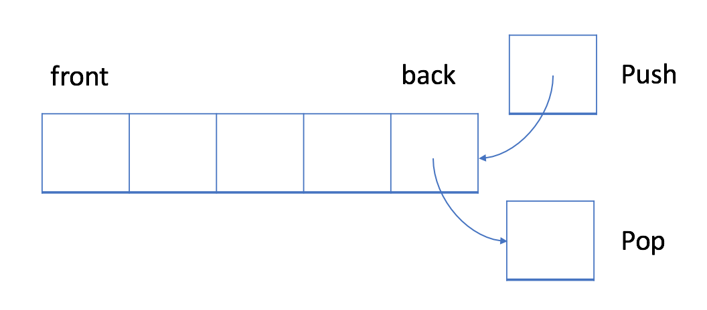

在 LIFO 数据结构中，将首先处理添加到队列中的最新元素。

与队列不同，栈是一个 LIFO 数据结构。通常，插入操作在栈中被称作入栈 push 。与队列类似，总是在堆栈的末尾添加一个新元素。但是，删除操作，退栈 pop ，将始终删除队列中相对于它的最后一个元素。


#### 实现

栈的实现比队列容易。`动态数组`足以实现堆栈结构。

```java
// "static void main" must be defined in a public class.
class MyStack {
    private List<Integer> data;               // store elements
    public MyStack() {
        data = new ArrayList<>();
    }
    /** Insert an element into the stack. */
    public void push(int x) {
        data.add(x);
    }
    /** Checks whether the queue is empty or not. */
    public boolean isEmpty() {
        return data.isEmpty();
    }
    /** Get the top item from the queue. */
    public int top() {
        return data.get(data.size() - 1);
    }
    /** Delete an element from the queue. Return true if the operation is successful. */
    public boolean pop() {
        if (isEmpty()) {
            return false;
        }
        data.remove(data.size() - 1);
        return true;
    }
};

public class Main {
    public static void main(String[] args) {
        MyStack s = new MyStack();
        s.push(1);
        s.push(2);
        s.push(3);
        for (int i = 0; i < 4; ++i) {
            if (!s.isEmpty()) {
                System.out.println(s.top());
            }
            System.out.println(s.pop());
        }
    }
}
```

#### 用法

大多数流行的语言都提供了内置的栈库，因此你不必重新发明轮子。除了初始化，我们还需要知道如何使用两个最重要的操作：入栈和退栈。除此之外，你应该能够从栈中获得顶部元素。

### 最小栈

设计一个支持 push ，pop ，top 操作，并能在常数时间内检索到最小元素的栈。

push(x) —— 将元素 x 推入栈中。
pop() —— 删除栈顶的元素。
top() —— 获取栈顶元素。
getMin() —— 检索栈中的最小元素。


示例:

输入：
["MinStack","push","push","push","getMin","pop","top","getMin"]
[[],[-2],[0],[-3],[],[],[],[]]

输出：
[null,null,null,null,-3,null,0,-2]

解释：
MinStack minStack = new MinStack();
minStack.push(-2);
minStack.push(0);
minStack.push(-3);
minStack.getMin();   --> 返回 -3.
minStack.pop();
minStack.top();      --> 返回 0.
minStack.getMin();   --> 返回 -2.


提示：

pop、top 和 getMin 操作总是在 非空栈 上调用。


### 有效的括号 isValid

给定一个只包括 '('，')'，'{'，'}'，'['，']' 的字符串，判断字符串是否有效。

有效字符串需满足：

左括号必须用相同类型的右括号闭合。
左括号必须以正确的顺序闭合。
注意空字符串可被认为是有效字符串。

示例 1:

输入: "()"
输出: true
示例 2:

输入: "()[]{}"
输出: true
示例 3:

输入: "(]"
输出: false
示例 4:

输入: "([)]"
输出: false
示例 5:

输入: "{[]}"
输出: true

### 每日温度 dailyTemperatures

请根据每日 气温 列表，重新生成一个列表。对应位置的输出为：要想观测到更高的气温，至少需要等待的天数。如果气温在这之后都不会升高，请在该位置用 0 来代替。

例如，给定一个列表 temperatures = [73, 74, 75, 71, 69, 72, 76, 73]，你的输出应该是 [1, 1, 4, 2, 1, 1, 0, 0]。

提示：气温 列表长度的范围是 [1, 30000]。每个气温的值的均为华氏度，都是在 [30, 100] 范围内的整数。


