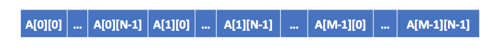
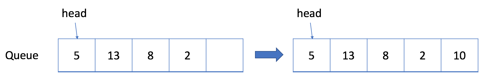
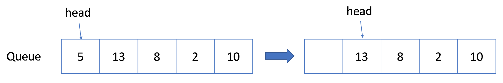

# 数据结构DataStructure

[TOC]


# 数组和字符串

`数组`是数据结构中的基本模块之一。因为`字符串`是由字符数组形成的，所以二者是相似的。

## (一维)数组简介

`数组`和`动态数组`，是应当熟悉的基本数据结构

> **数组**

`数组`是一种基本的数据结构，用于按顺序`存储元素的集合`。但是元素可以随机存取，因为数组中的每个元素都可以通过数组`索引`来识别。

数组可以有一个或多个维度。这里我们从`一维数组`开始，它也被称为线性数组。这里有一个例子：


在上面的例子中，数组 A 中有 6 个元素。也就是说，A 的长度是 6 。我们可以使用 A[0] 来表示数组中的第一个元素。因此，A[0] = 6 。类似地，A[1] = 3，A[2] = 8，依此类推。

> **动态数组**

数组具有`固定的容量`，我们需要在初始化时指定数组的大小。有时它会非常不方便并可能造成浪费。

因此，大多数编程语言都提供内置的`动态数组`，它仍然是一个随机存取的列表数据结构，但`大小是可变的`。例如，在 C++ 中的 `vector`，以及在 Java 中的 `ArrayList`。


## 寻找数组的中心索引pivotIndex

给定一个整数类型的数组 `nums`，请编写一个能够返回数组**“中心索引”**的方法。

我们是这样定义数组**中心索引**的：数组中心索引的左侧所有元素相加的和等于右侧所有元素相加的和。

如果数组不存在中心索引，那么我们应该返回 -1。如果数组有多个中心索引，那么我们应该返回最靠近左边的那一个。

**示例 1:**

```
输入: 
nums = [1, 7, 3, 6, 5, 6]
输出: 3
解释: 
索引3 (nums[3] = 6) 的左侧数之和(1 + 7 + 3 = 11)，与右侧数之和(5 + 6 = 11)相等。
同时, 3 也是第一个符合要求的中心索引。
```

**示例 2:**

```
输入: 
nums = [1, 2, 3]
输出: -1
解释: 
数组中不存在满足此条件的中心索引。
```

**说明:**

- `nums` 的长度范围为 `[0, 10000]`。
- 任何一个 `nums[i]` 将会是一个范围在 `[-1000, 1000]`的整数。


## 至少是其他数字两倍的最大数dominantIndex


在一个给定的数组`nums`中，总是存在一个最大元素 。

查找数组中的最大元素是否至少是数组中每个其他数字的两倍。

如果是，则返回最大元素的索引，否则返回-1。

**示例 1:**

```
输入: nums = [3, 6, 1, 0]
输出: 1
解释: 6是最大的整数, 对于数组中的其他整数,
6大于数组中其他元素的两倍。6的索引是1, 所以我们返回1.
```

 

**示例 2:**

```
输入: nums = [1, 2, 3, 4]
输出: -1
解释: 4没有超过3的两倍大, 所以我们返回 -1.
```

 

**提示:**

1. `nums` 的长度范围在`[1, 50]`.
2. 每个 `nums[i]` 的整数范围在 `[0, 100]`.


## 加一plusOne


给定一个由**整数**组成的**非空**数组所表示的非负整数，在该数的基础上加一。

最高位数字存放在数组的首位， 数组中每个元素只存储**单个**数字。

你可以假设除了整数 0 之外，这个整数不会以零开头。

**示例 1:**

```
输入: [1,2,3]
输出: [1,2,4]
解释: 输入数组表示数字 123。
```

**示例 2:**

```
输入: [4,3,2,1]
输出: [4,3,2,2]
解释: 输入数组表示数字 4321。
```


## 二维数组简介

类似于一维数组，`二维数组`也是由元素的序列组成。但是这些元素可以排列在矩形网格中而不是直线上。

在一些语言中，多维数组实际上是在`内部`作为一维数组实现的，而在其他一些语言中，`实际上`根本没有`多维数组`。

 

**1. C++ 将二维数组存储为一维数组。**

下图显示了*大小为 M \* N 的数组 A* 的实际结构：



因此，如果我们将 A 定义为也包含 *M \* N* 个元素的一维数组，那么实际上 A[i][j] 就等于 A[i * N + j]。

 

**2. 在Java中，二维数组实际上是包含着 M 个元素的一维数组，每个元素都是包含有 N 个整数的数组。**

下图显示了 Java 中二维数组 A 的实际结构：


 

### 动态二维数组

------

与一维动态数组类似，我们也可以定义动态二维数组。 实际上，它可以只是一个嵌套的动态数组。 


## 对角线遍历findDiagonalOrder

给定一个含有 M x N 个元素的矩阵（M 行，N 列），请以对角线遍历的顺序返回这个矩阵中的所有元素，对角线遍历如下图所示。

 **示例:**

```
输入:
[
 [ 1, 2, 3 ],
 [ 4, 5, 6 ],
 [ 7, 8, 9 ]
]

输出:  [1,2,4,7,5,3,6,8,9]
1、2、3、4
5、6、7、8
9、8、6、6

1 2 5 9 6 3 4 7 8 16 8 6
m3 n4 (2,3)
(0,0)
(0,1)(1,0)
(2,0)(1,1)(0,2)
(0,3)(1,2)(2,1)
(2,2)(1,3)
(2,3)
1 2 5 9 6 3 4 7 8 16 8 6
```

 

**说明:**

1. 给定矩阵中的元素总数不会超过 100000 。


# 队列

## 队列简介

> **先入先出的数据结构**

------


在 FIFO 数据结构中，将`首先处理添加到队列中的第一个元素`。

如上图所示，队列是典型的 FIFO 数据结构。插入（insert）操作也称作入队（enqueue），新元素始终被添加在`队列的末尾`。 删除（delete）操作也被称为出队（dequeue)。 你只能移除`第一个元素`。

## 队列 - 实现

------

为了实现队列，我们可以使用动态数组和指向队列头部的索引。

如上所述，队列应支持两种操作：入队和出队。入队会向队列追加一个新元素，而出队会删除第一个元素。 所以我们需要一个索引来指出起点。

```c++
#include <iostream>

class MyQueue {
    private:
        // store elements
        vector<int> data;       
        // a pointer to indicate the start position
        int p_start;            
    public:
        MyQueue() {p_start = 0;}
        /** Insert an element into the queue. Return true if the operation is successful. */
        bool enQueue(int x) {
            data.push_back(x);
            return true;
        }
        /** Delete an element from the queue. Return true if the operation is successful. */
        bool deQueue() {
            if (isEmpty()) {
                return false;
            }
            p_start++;
            return true;
        };
        /** Get the front item from the queue. */
        int Front() {
            return data[p_start];
        };
        /** Checks whether the queue is empty or not. */
        bool isEmpty()  {
            return p_start >= data.size();
        }
};
```


```java
// "static void main" must be defined in a public class.

class MyQueue {
    // store elements
    private List<Integer> data;         
    // a pointer to indicate the start position
    private int p_start;            
    public MyQueue() {
        data = new ArrayList<Integer>();
        p_start = 0;
    }
    /** Insert an element into the queue. Return true if the operation is successful. */
    public boolean enQueue(int x) {
        data.add(x);
        return true;
    };    
    /** Delete an element from the queue. Return true if the operation is successful. */
    public boolean deQueue() {
        if (isEmpty() == true) {
            return false;
        }
        p_start++;
        return true;
    }
    /** Get the front item from the queue. */
    public int Front() {
        return data.get(p_start);
    }
    /** Checks whether the queue is empty or not. */
    public boolean isEmpty() {
        return p_start >= data.size();
    }     
};

public class Main {
    public static void main(String[] args) {
        MyQueue q = new MyQueue();
        q.enQueue(5);
        q.enQueue(3);
        if (q.isEmpty() == false) {
            System.out.println(q.Front());
        }
        q.deQueue();
        if (q.isEmpty() == false) {
            System.out.println(q.Front());
        }
        q.deQueue();
        if (q.isEmpty() == false) {
            System.out.println(q.Front());
        }
    }
}
```

上面的实现很简单，但在某些情况下效率很低。 随着起始指针的移动，浪费了越来越多的空间。 当我们有空间限制时，这将是难以接受的。



让我们考虑一种情况，即我们只能分配一个最大长度为 5 的数组。当我们只添加少于 5 个元素时，我们的解决方案很有效。 例如，如果我们只调用入队函数四次后还想要将元素 10 入队，那么我们可以成功。

但是我们不能接受更多的入队请求，这是合理的，因为现在队列已经满了。但是如果我们将一个元素出队呢？


实际上，在这种情况下，我们应该能够再接受一个元素。


## 循环队列

------

此前，我们提供了一种简单但低效的队列实现。

更有效的方法是使用循环队列。 具体来说，我们可以使用`固定大小的数组`和`两个指针`来指示起始位置和结束位置。 目的是`重用`我们之前提到的`被浪费的存储`。

让我们通过一个示例来查看循环队列的工作原理。 你应该注意我们`入队`或`出队`元素时使用的策略。

### 设计循环队列

------

设计你的循环队列实现。 循环队列是一种线性数据结构，其操作表现基于 FIFO（先进先出）原则并且队尾被连接在队首之后以形成一个循环。它也被称为“环形缓冲器”。

循环队列的一个好处是我们可以利用这个队列之前用过的空间。在一个普通队列里，一旦一个队列满了，我们就不能插入下一个元素，即使在队列前面仍有空间。但是使用循环队列，我们能使用这些空间去存储新的值。

你的实现应该支持如下操作：

- `MyCircularQueue(k)`: 构造器，设置队列长度为 k 。
- `Front`: 从队首获取元素。如果队列为空，返回 -1 。
- `Rear`: 获取队尾元素。如果队列为空，返回 -1 。
- `enQueue(value)`: 向循环队列插入一个元素。如果成功插入则返回真。
- `deQueue()`: 从循环队列中删除一个元素。如果成功删除则返回真。
- `isEmpty()`: 检查循环队列是否为空。
- `isFull()`: 检查循环队列是否已满。

```c
MyCircularQueue circularQueue = new MyCircularQueue(3); // 设置长度为 3

circularQueue.enQueue(1);  // 返回 true

circularQueue.enQueue(2);  // 返回 true

circularQueue.enQueue(3);  // 返回 true

circularQueue.enQueue(4);  // 返回 false，队列已满

circularQueue.Rear();  // 返回 3

circularQueue.isFull();  // 返回 true

circularQueue.deQueue();  // 返回 true

circularQueue.enQueue(4);  // 返回 true

circularQueue.Rear();  // 返回 4
```

### 实现循环队列

在循环队列中，我们使用一个`数组`和两个指针（`head` 和 `tail`）。 `head` 表示队列的起始位置，`tail` 表示队列的结束位置。

### 示例

```java
class MyCircularQueue {
    
    private int[] data;
    private int head;
    private int tail;
    private int size;

    /** Initialize your data structure here. Set the size of the queue to be k. */
    public MyCircularQueue(int k) {
        data = new int[k];
        head = -1;
        tail = -1;
        size = k;
    }
    
    /** Insert an element into the circular queue. Return true if the operation is successful. */
    public boolean enQueue(int value) {
        if (isFull() == true) {
            return false;
        }
        if (isEmpty() == true) {
            head = 0;
        }
        tail = (tail + 1) % size;
        data[tail] = value;
        return true;
    }
    
    /** Delete an element from the circular queue. Return true if the operation is successful. */
    public boolean deQueue() {
        if (isEmpty() == true) {
            return false;
        }
        if (head == tail) {
            head = -1;
            tail = -1;
            return true;
        }
        head = (head + 1) % size;
        return true;
    }
    
    /** Get the front item from the queue. */
    public int Front() {
        if (isEmpty() == true) {
            return -1;
        }
        return data[head];
    }
    
    /** Get the last item from the queue. */
    public int Rear() {
        if (isEmpty() == true) {
            return -1;
        }
        return data[tail];
    }
    
    /** Checks whether the circular queue is empty or not. */
    public boolean isEmpty() {
        return head == -1;
    }
    
    /** Checks whether the circular queue is full or not. */
    public boolean isFull() {
        return ((tail + 1) % size) == head;
    }
}

/**
 * Your MyCircularQueue object will be instantiated and called as such:
 * MyCircularQueue obj = new MyCircularQueue(k);
 * boolean param_1 = obj.enQueue(value);
 * boolean param_2 = obj.deQueue();
 * int param_3 = obj.Front();
 * int param_4 = obj.Rear();
 * boolean param_5 = obj.isEmpty();
 * boolean param_6 = obj.isFull();
 */
```


循环队列-实现

```
typedef struct{
    int* head;
    int* tail;
    int* queue;
    int size;
    int currentSize;
}MyCircularQueue;

/** Initialize your data structure here. Set the size of the queue to be k. */
MyCircularQueue* myCircularQueueCreate(int k) {
        MyCircularQueue* mcq;

    mcq = (MyCircularQueue*)malloc( sizeof(MyCircularQueue) );

    printf("[%p]\n", mcq );

    mcq->queue = (int*)malloc( sizeof(int) * k + 1 );
    mcq->head = mcq->queue;
    mcq->tail = mcq->queue + k - 1;
    mcq->size = k;
    mcq->currentSize = 0;

    printf("[%p]\n", mcq );

    return mcq;
}

/** Insert an element into the circular queue. Return true if the operation is successful. */
bool myCircularQueueEnQueue(MyCircularQueue* obj, int value) {
    if( obj->currentSize >= obj->size ){
        return false;
    }

    obj->currentSize++;
    obj->tail++;

    if( obj->tail - obj->queue == obj->size ){
        obj->tail = obj->queue;
    }

    *(obj->tail) = value;

    return true;
}

/** Delete an element from the circular queue. Return true if the operation is successful. */
bool myCircularQueueDeQueue(MyCircularQueue* obj) {
    if( obj->currentSize <= 0 ){
        obj->head = obj->queue;
        obj->tail = obj->queue + obj->size - 1;
        return false;
    }

    obj->currentSize--;
    *(obj->head) = -1;

    obj->head++;
    if( obj->head - obj->queue == obj->size  ){
        obj->head = obj->queue;
    }

    return true;
}

/** Get the front item from the queue. */
int myCircularQueueFront(MyCircularQueue* obj) {
    if( obj->currentSize > 0 ){
        return *(obj->head);
    }

    return -1;
}

/** Get the last item from the queue. */
int myCircularQueueRear(MyCircularQueue* obj) {
    if( obj->currentSize > 0 ){
        return *(obj->tail);
    }

    return -1;
}

/** Checks whether the circular queue is empty or not. */
bool myCircularQueueIsEmpty(MyCircularQueue* obj) {
    if( obj->currentSize == 0 ){
        return true;
    }

    return false;
}

/** Checks whether the circular queue is full or not. */
bool myCircularQueueIsFull(MyCircularQueue* obj) {
    if( obj->currentSize == obj->size ){
        return true;
    }

    return false;
}

void myCircularQueueFree(MyCircularQueue* obj) {
    if( obj->queue != NULL ){
        free( obj->queue );
        obj->head = NULL;
        obj->tail = NULL;
        obj->queue= NULL;
    }

    if( obj != NULL ){
        free(obj);
        obj = NULL;
    }
}

void MyCircularQueueItera(MyCircularQueue* obj) {
    int* ptr = NULL;
    ptr = obj->queue;
    for(int i=0; i<obj->size; i++){
        printf( "[%d]\t", *ptr++);
    }
}

/**
 * Your MyCircularQueue struct will be instantiated and called as such:
 * MyCircularQueue* obj = myCircularQueueCreate(k);
 * bool param_1 = myCircularQueueEnQueue(obj, value);
 
 * bool param_2 = myCircularQueueDeQueue(obj);
 
 * int param_3 = myCircularQueueFront(obj);
 
 * int param_4 = myCircularQueueRear(obj);
 
 * bool param_5 = myCircularQueueIsEmpty(obj);
 
 * bool param_6 = myCircularQueueIsFull(obj);
 
 * myCircularQueueFree(obj);
*/
```

## 队列和 BFS

广度优先搜索（BFS）的一个常见应用是找出从根结点到目标结点的最短路径。

### 洞悉

**1. 结点的处理顺序是什么？**

在第一轮中，我们处理根结点。在第二轮中，我们处理根结点旁边的结点；在第三轮中，我们处理距根结点两步的结点；等等等等。

与树的层序遍历类似，`越是接近根结点的结点将越早地遍历`。

如果在第 k 轮中将结点 `X` 添加到队列中，则根结点与 `X` 之间的最短路径的长度恰好是 `k`。也就是说，第一次找到目标结点时，你已经处于最短路径中。

**2. 队列的入队和出队顺序是什么？**

如上面的动画所示，我们首先将根结点排入队列。然后在每一轮中，我们逐个处理已经在队列中的结点，并将所有邻居添加到队列中。值得注意的是，新添加的节点`不会`立即遍历，而是在下一轮中处理。

结点的处理顺序与它们`添加`到队列的顺序是`完全相同的顺序`，即先进先出（FIFO）。这就是我们在 BFS 中使用队列的原因。

## 广度优先搜索 - 模板

------

之前，我们已经介绍了使用 BFS 的两个主要方案：`遍历`或`找出最短路径`。通常，这发生在树或图中。正如我们在章节描述中提到的，BFS 也可以用于更抽象的场景中。

在本文中，我们将为你提供一个模板。然后，我们在本文后提供一些习题供你练习。

> 在特定问题中执行 BFS 之前确定结点和边缘非常重要。通常，结点将是实际结点或是状态，而边缘将是实际边缘或可能的转换。

### 模板Ⅰ

```
/**
 * Return the length of the shortest path between root and target node.
 */
int BFS(Node root, Node target) {
    Queue<Node> queue;  // store all nodes which are waiting to be processed
    int step = 0;       // number of steps neeeded from root to current node
    // initialize
    add root to queue;
    // BFS
    while (queue is not empty) {
        step = step + 1;
        // iterate the nodes which are already in the queue
        int size = queue.size();
        for (int i = 0; i < size; ++i) {
            Node cur = the first node in queue;
            return step if cur is target;
            for (Node next : the neighbors of cur) {
                add next to queue;
            }
            remove the first node from queue;
        }
    }
    return -1;          // there is no path from root to target
}
```

### 模板Ⅱ

有时，确保我们永远`不会访问一个结点两次`很重要。否则，我们可能陷入无限循环。

```
/**
 * Return the length of the shortest path between root and target node.
 */
int BFS(Node root, Node target) {
    Queue<Node> queue;  // store all nodes which are waiting to be processed
    Set<Node> used;     // store all the used nodes
    int step = 0;       // number of steps neeeded from root to current node
    // initialize
    add root to queue;
    add root to used;
    // BFS
    while (queue is not empty) {
        step = step + 1;
        // iterate the nodes which are already in the queue
        int size = queue.size();
        for (int i = 0; i < size; ++i) {
            Node cur = the first node in queue;
            return step if cur is target;
            for (Node next : the neighbors of cur) {
                if (next is not in used) {
                    add next to queue;
                    add next to used;
                }
            }
            remove the first node from queue;
        }
    }
    return -1;          // there is no path from root to target
}
```


## 岛屿数量numIsland

### tags: 深度优先搜索DFS、广度优先搜索BFS、并查集UFS

给你一个由 `'1'`（陆地）和 `'0'`（水）组成的的二维网格，请你计算网格中岛屿的数量。

岛屿总是被水包围，并且每座岛屿只能由水平方向或竖直方向上相邻的陆地连接形成。

此外，你可以假设该网格的四条边均被水包围。 

**示例 1:**

```
输入:
11110
11010
11000
00000
输出: 1
```

**示例 2:**

```
输入:
11000
11000
00100
00011
输出: 3
解释: 每座岛屿只能由水平和/或竖直方向上相邻的陆地连接而成。
```


## 打开转盘锁openLock

### tags：广度优先搜索BFS

你有一个带有四个圆形拨轮的转盘锁。每个拨轮都有10个数字： `'0', '1', '2', '3', '4', '5', '6', '7', '8', '9'` 。每个拨轮可以自由旋转：例如把 `'9'` 变为  `'0'`，`'0'` 变为 `'9'` 。每次旋转都只能旋转一个拨轮的一位数字。

锁的初始数字为 `'0000'` ，一个代表四个拨轮的数字的字符串。

列表 `deadends` 包含了一组死亡数字，一旦拨轮的数字和列表里的任何一个元素相同，这个锁将会被永久锁定，无法再被旋转。

字符串 `target` 代表可以解锁的数字，你需要给出最小的旋转次数，如果无论如何不能解锁，返回 -1。 

**示例 1:**

```
输入：deadends = ["0201","0101","0102","1212","2002"], target = "0202"
输出：6
解释：
可能的移动序列为 "0000" -> "1000" -> "1100" -> "1200" -> "1201" -> "1202" -> "0202"。
注意 "0000" -> "0001" -> "0002" -> "0102" -> "0202" 这样的序列是不能解锁的，
因为当拨动到 "0102" 时这个锁就会被锁定。
```

**示例 2:**

```
输入: deadends = ["8888"], target = "0009"
输出：1
解释：
把最后一位反向旋转一次即可 "0000" -> "0009"。
```

**示例 3:**

```
输入: deadends = ["8887","8889","8878","8898","8788","8988","7888","9888"], target = "8888"
输出：-1
解释：
无法旋转到目标数字且不被锁定。
```

**示例 4:**

```
输入: deadends = ["0000"], target = "8888"
输出：-1
```

 **提示：**

1. 死亡列表 `deadends` 的长度范围为 `[1, 500]`。
2. 目标数字 `target` 不会在 `deadends` 之中。
3. 每个 `deadends` 和 `target` 中的字符串的数字会在 10,000 个可能的情况 `'0000'` 到 `'9999'` 中产生。

## 完全平方数numSquares

### tags：

给定正整数 *n*，找到若干个完全平方数（比如 `1, 4, 9, 16, ...`）使得它们的和等于 *n*。你需要让组成和的完全平方数的个数最少。

**示例 1:**

```
输入: n = 12
输出: 3 
解释: 12 = 4 + 4 + 4.
```

**示例 2:**

```
输入: n = 13
输出: 2
解释: 13 = 4 + 9.
```


# 栈

### 