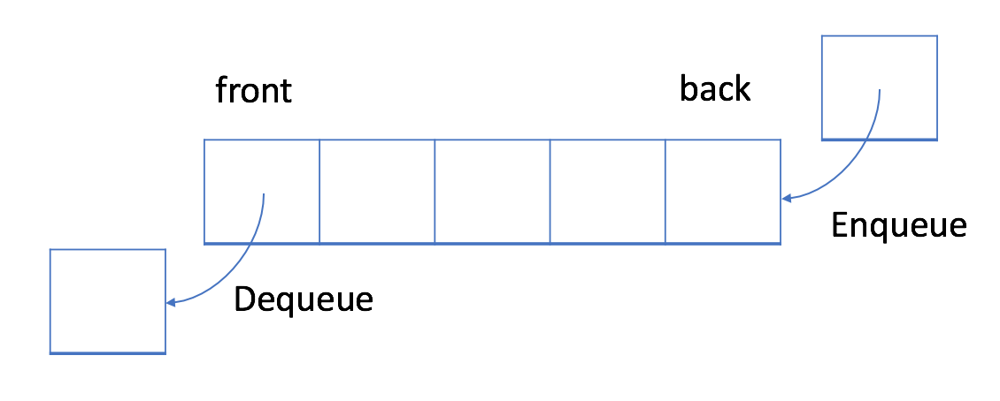

# Queue


先入先出的数据结构

------



在 FIFO 数据结构中，将`首先处理添加到队列中的第一个元素`。

如上图所示，队列是典型的 FIFO 数据结构。插入（insert）操作也称作入队（enqueue），新元素始终被添加在`队列的末尾`。 删除（delete）操作也被称为出队（dequeue)。 你只能移除`第一个元素`。

队列 - 实现

------

为了实现队列，我们可以使用动态数组和指向队列头部的索引。

如上所述，队列应支持两种操作：入队和出队。入队会向队列追加一个新元素，而出队会删除第一个元素。 所以我们需要一个索引来指出起点。

循环队列

------

此前，我们提供了一种简单但低效的队列实现。

更有效的方法是使用循环队列。 具体来说，我们可以使用`固定大小的数组`和`两个指针`来指示起始位置和结束位置。 目的是`重用`我们之前提到的`被浪费的存储`。

让我们通过一个示例来查看循环队列的工作原理。 你应该注意我们`入队`或`出队`元素时使用的策略。

设计循环队列

------

设计你的循环队列实现。 循环队列是一种线性数据结构，其操作表现基于 FIFO（先进先出）原则并且队尾被连接在队首之后以形成一个循环。它也被称为“环形缓冲器”。

循环队列的一个好处是我们可以利用这个队列之前用过的空间。在一个普通队列里，一旦一个队列满了，我们就不能插入下一个元素，即使在队列前面仍有空间。但是使用循环队列，我们能使用这些空间去存储新的值。

你的实现应该支持如下操作：

- `MyCircularQueue(k)`: 构造器，设置队列长度为 k 。
- `Front`: 从队首获取元素。如果队列为空，返回 -1 。
- `Rear`: 获取队尾元素。如果队列为空，返回 -1 。
- `enQueue(value)`: 向循环队列插入一个元素。如果成功插入则返回真。
- `deQueue()`: 从循环队列中删除一个元素。如果成功删除则返回真。
- `isEmpty()`: 检查循环队列是否为空。
- `isFull()`: 检查循环队列是否已满。

```
typedef struct{
    int* head;
    int* tail;
    int* queue;
    int size;
    int currentSize;
}MyCircularQueue;

/** Initialize your data structure here. Set the size of the queue to be k. */
MyCircularQueue* myCircularQueueCreate(int k) {
        MyCircularQueue* mcq;

    mcq = (MyCircularQueue*)malloc( sizeof(MyCircularQueue) );

    printf("[%p]\n", mcq );

    mcq->queue = (int*)malloc( sizeof(int) * k + 1 );
    mcq->head = mcq->queue;
    mcq->tail = mcq->queue + k - 1;
    mcq->size = k;
    mcq->currentSize = 0;

    printf("[%p]\n", mcq );

    return mcq;
}

/** Insert an element into the circular queue. Return true if the operation is successful. */
bool myCircularQueueEnQueue(MyCircularQueue* obj, int value) {
    if( obj->currentSize >= obj->size ){
        return false;
    }

    obj->currentSize++;
    obj->tail++;

    if( obj->tail - obj->queue == obj->size ){
        obj->tail = obj->queue;
    }

    *(obj->tail) = value;

    return true;
}

/** Delete an element from the circular queue. Return true if the operation is successful. */
bool myCircularQueueDeQueue(MyCircularQueue* obj) {
    if( obj->currentSize <= 0 ){
        obj->head = obj->queue;
        obj->tail = obj->queue + obj->size - 1;
        return false;
    }

    obj->currentSize--;
    *(obj->head) = -1;

    obj->head++;
    if( obj->head - obj->queue == obj->size  ){
        obj->head = obj->queue;
    }

    return true;
}

/** Get the front item from the queue. */
int myCircularQueueFront(MyCircularQueue* obj) {
    if( obj->currentSize > 0 ){
        return *(obj->head);
    }

    return -1;
}

/** Get the last item from the queue. */
int myCircularQueueRear(MyCircularQueue* obj) {
    if( obj->currentSize > 0 ){
        return *(obj->tail);
    }

    return -1;
}

/** Checks whether the circular queue is empty or not. */
bool myCircularQueueIsEmpty(MyCircularQueue* obj) {
    if( obj->currentSize == 0 ){
        return true;
    }

    return false;
}

/** Checks whether the circular queue is full or not. */
bool myCircularQueueIsFull(MyCircularQueue* obj) {
    if( obj->currentSize == obj->size ){
        return true;
    }

    return false;
}

void myCircularQueueFree(MyCircularQueue* obj) {
    if( obj->queue != NULL ){
        free( obj->queue );
        obj->head = NULL;
        obj->tail = NULL;
        obj->queue= NULL;
    }

    if( obj != NULL ){
        free(obj);
        obj = NULL;
    }
}

void MyCircularQueueItera(MyCircularQueue* obj) {
    int* ptr = NULL;
    ptr = obj->queue;
    for(int i=0; i<obj->size; i++){
        printf( "[%d]\t", *ptr++);
    }
}

/**
 * Your MyCircularQueue struct will be instantiated and called as such:
 * MyCircularQueue* obj = myCircularQueueCreate(k);
 * bool param_1 = myCircularQueueEnQueue(obj, value);
 
 * bool param_2 = myCircularQueueDeQueue(obj);
 
 * int param_3 = myCircularQueueFront(obj);
 
 * int param_4 = myCircularQueueRear(obj);
 
 * bool param_5 = myCircularQueueIsEmpty(obj);
 
 * bool param_6 = myCircularQueueIsFull(obj);
 
 * myCircularQueueFree(obj);
*/
```


# 队列和 BFS


广度优先搜索（BFS）的一个常见应用是找出从根结点到目标结点的最短路径。

**1. 结点的处理顺序是什么？**

在第一轮中，我们处理根结点。在第二轮中，我们处理根结点旁边的结点；在第三轮中，我们处理距根结点两步的结点；等等等等。

与树的层序遍历类似，`越是接近根结点的结点将越早地遍历`。

如果在第 k 轮中将结点 `X` 添加到队列中，则根结点与 `X` 之间的最短路径的长度恰好是 `k`。也就是说，第一次找到目标结点时，你已经处于最短路径中。

**2. 队列的入队和出队顺序是什么？**

如上面的动画所示，我们首先将根结点排入队列。然后在每一轮中，我们逐个处理已经在队列中的结点，并将所有邻居添加到队列中。值得注意的是，新添加的节点`不会`立即遍历，而是在下一轮中处理。

结点的处理顺序与它们`添加`到队列的顺序是`完全相同的顺序`，即先进先出（FIFO）。这就是我们在 BFS 中使用队列的原因。

## 广度优先搜索 - 模板

------

之前，我们已经介绍了使用 BFS 的两个主要方案：`遍历`或`找出最短路径`。通常，这发生在树或图中。正如我们在章节描述中提到的，BFS 也可以用于更抽象的场景中。

在本文中，我们将为你提供一个模板。然后，我们在本文后提供一些习题供你练习。

> 在特定问题中执行 BFS 之前确定结点和边缘非常重要。通常，结点将是实际结点或是状态，而边缘将是实际边缘或可能的转换。